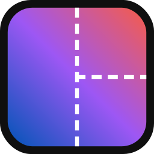
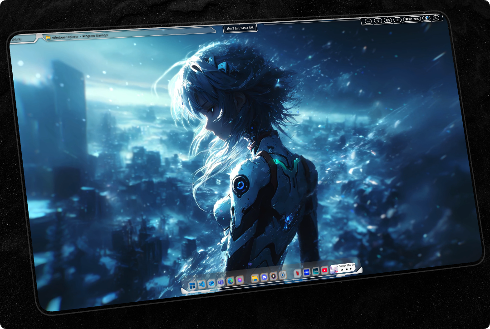
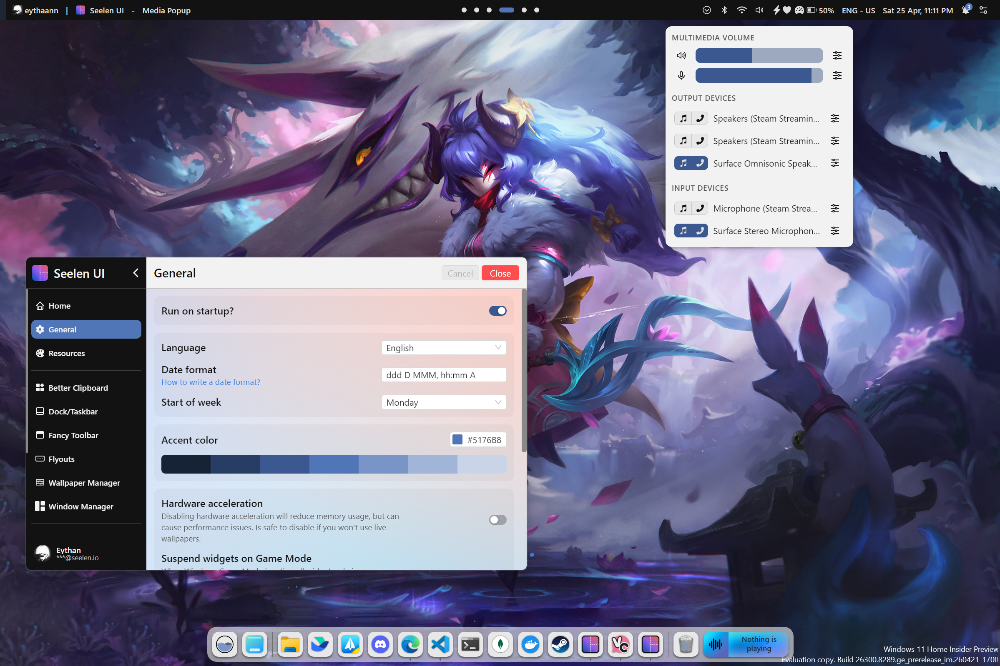
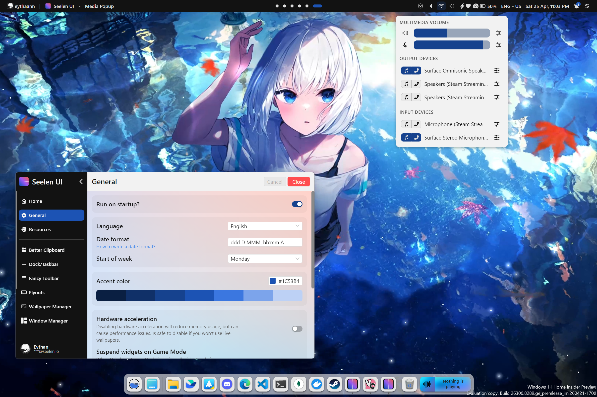
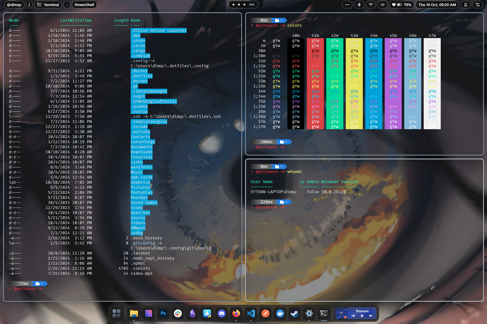
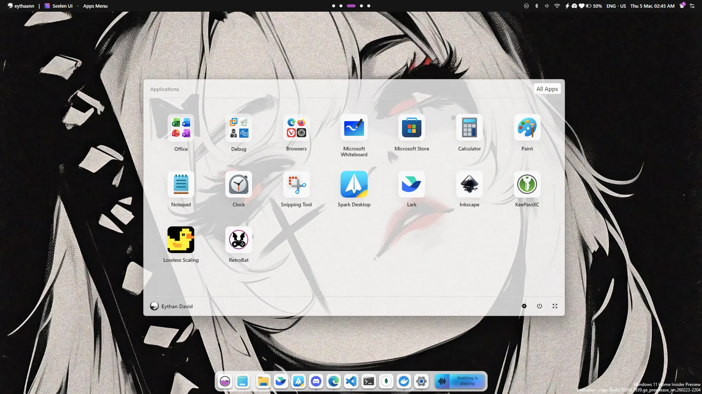
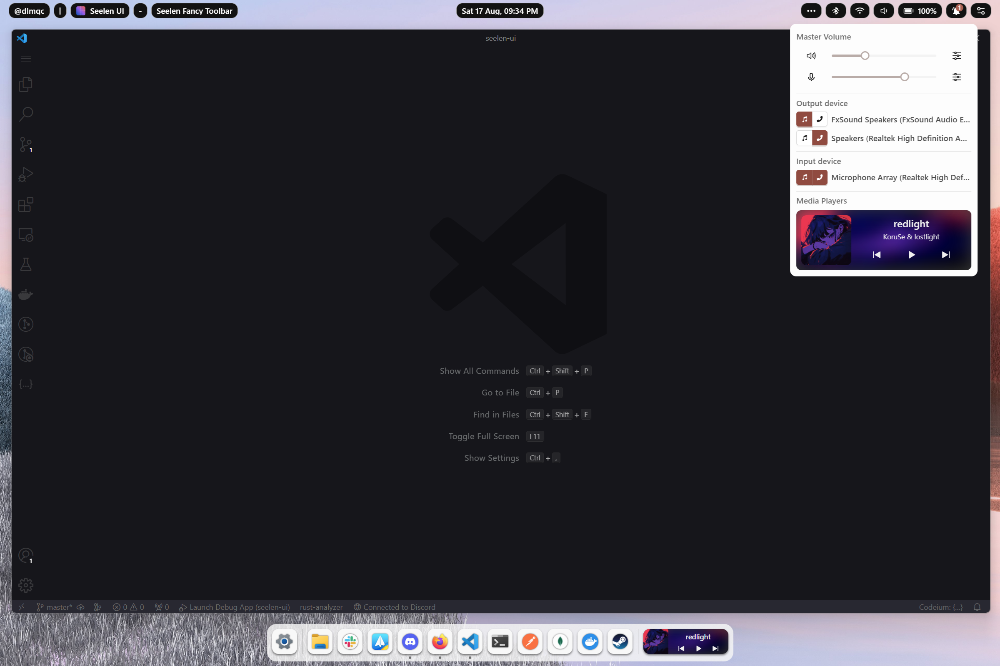
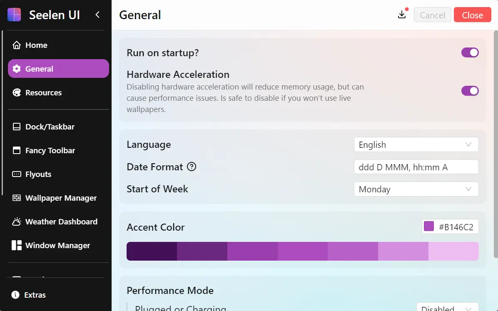

<h1 align="center">
  
  Seelen UI
</h1>

<h2 align="center">
  Fully Customizable Desktop Environment for Windows
  <br/>
  Available in 70+ Languages
</h2>

<div align="center">

[](https://github.com/eythaann/seelen-ui/graphs/contributors)
[](https://github.com/eythaann/seelen-ui/commits/main)
[](https://github.com/eythaann/seelen-ui/releases)
[](https://github.com/eythaann/seelen-ui/releases)

</div>


<table align="center">
  <tr>
    <td align="center" width="33%">
      <a
        href="https://apps.microsoft.com/detail/Seelen%20UI/9p67c2d4t9fb?mode=full"
        target="_blank"
        rel="noopener noreferrer"
        aria-label="Download Seelen UI from Microsoft Store">
        
      </a>
    </td>
    <td align="center" width="33%">
      <a
        href="https://discord.gg/ABfASx5ZAJ"
        target="_blank"
        rel="noopener noreferrer"
        aria-label="Join the Seelen UI Discord community">
        
      </a>
    </td>
    <td align="center" width="33%">
      <a
        href='https://www.digitalocean.com/?refcode=955c7335abf5&utm_campaign=Referral_Invite&utm_medium=Referral_Program&utm_source=badge'
        target='_blank'
        rel="noopener noreferrer"
        aria-label="DigitalOcean Referral Badge"
      >
        
      </a>
    </td>
  </tr>
</table>

---

## What is Seelen UI?

[Seelen UI](https://seelen.io/apps/seelen-ui) is a full desktop environment replacement for Windows — not a theme pack,
not a skin, but a complete rethink of how your desktop looks and works. Every element you interact with daily — the
taskbar, the dock, the app launcher, the window manager, the notification flyouts, the virtual desktops — can be
replaced, restyled, and extended to exactly match your vision and workflow.

Whether you want a minimal, distraction-free setup or a feature-rich power-user environment, Seelen UI gives you the
primitives to build it. With a CSS/JSON-based theming engine, a plugin widget system, and deep Windows integration, the
only limit is your imagination.

---

## Feature Showcase

### Themes & Visual Identity

Make Windows look the way you always wanted. Seelen UI ships with a powerful theming engine that lets you craft or
install community themes covering every surface of the shell — colors, fonts, borders, animations, and more.



<br/>

### Dynamic Accent Color

Set your accent color once and forget it. Seelen UI analyzes your wallpaper in real time and automatically derives a
harmonious accent color, keeping every shell element visually in sync with your background — no manual tweaking needed.

<table>
  <tr>
    <td></td>
    <td></td>
  </tr>
  <tr>
    <td></td>
    <td></td>
  </tr>
</table>

<br/>

### Tiling Window Manager

Stop dragging windows. Seelen UI's tiling window manager automatically arranges your open applications into efficient,
gap-controlled layouts. Resize, swap, and navigate entirely from the keyboard — your hands never leave the keys.



<br/>

### Desktop Widgets

Bring information to your desktop without opening apps. Place clocks, system monitors, media controls, weather panels,
and any custom widget directly on your wallpaper layer — fully theme-aware and always within sight.


<br/>

### App Launcher

Launch anything instantly with a keyboard-driven launcher inspired by [Rofi](https://github.com/davatorium/rofi). Apps,
files, shell commands, custom scripts — surfaced with fuzzy search in milliseconds.



<br/>

### Media Controls

Control your music without switching windows. The integrated media module works with virtually every player and lets you
play, pause, skip, and scrub from any context, always accessible in the toolbar or as a dedicated widget.



<br/>

### Settings

One unified place to configure everything. Themes, layouts, keybindings, widget positions, workspace rules, per-app
overrides — all accessible through a clean, searchable settings interface with live preview.



---

## Complete Feature List

### Shell & Desktop

| Feature                    | Description                                                                                       |
| -------------------------- | ------------------------------------------------------------------------------------------------- |
| **Custom Toolbar**         | A fully themeable, widget-powered taskbar that replaces the Windows taskbar                       |
| **Custom Dock**            | macOS-style application dock with launch, focus, and badge support                                |
| **Desktop Widgets**        | Interactive widgets rendered directly on the desktop layer                                        |
| **Custom Flyouts**         | Replace Windows' built-in volume, brightness, and system flyouts with themed, customizable panels |
| **Start Menu Replacement** | Quick-access launcher replacing the native Start menu                                             |

### Window Management

| Feature                   | Description                                                     |
| ------------------------- | --------------------------------------------------------------- |
| **Tiling Window Manager** | Automatic tiling layouts: BSP, columns, stacks, and more        |
| **Custom Alt + Tab**      | A fully skinnable task switcher with richer window previews     |
| **Per-App Rules**         | Define layout, workspace, and floating behavior per application |
| **Floating Mode**         | Opt any window out of tiling while keeping the rest managed     |
| **Gaps & Padding**        | Configurable inner and outer gaps for any layout                |

### Workspaces

| Feature                     | Description                                                                   |
| --------------------------- | ----------------------------------------------------------------------------- |
| **Custom Virtual Desktops** | Full virtual desktop implementation with smooth animated transitions          |
| **Workspaces Viewer**       | A visual overview panel showing all workspaces and their content at a glance  |
| **Wallpaper per Workspace** | Assign a unique wallpaper to each workspace — changes automatically on switch |
| **Workspace Rules**         | Pin apps or app groups to specific workspaces on launch                       |
| **Named Workspaces**        | Give each workspace a custom name and icon                                    |

### Theming & Appearance

| Feature                     | Description                                                         |
| --------------------------- | ------------------------------------------------------------------- |
| **CSS/JSON Theming Engine** | Style every shell element with scoped CSS and JSON configuration    |
| **Dynamic Accent Color**    | Auto-extract accent color from the current wallpaper                |
| **Community Themes**        | Install and share themes from the community                         |
| **Per-Widget Theming**      | Each widget can carry its own independent style                     |
| **Dark / Light Mode**       | Full support for Windows dark and light mode, themeable per-variant |

### Productivity

| Feature                   | Description                                                 |
| ------------------------- | ----------------------------------------------------------- |
| **Keyboard-First Design** | Every feature reachable without touching the mouse          |
| **App Launcher**          | Fuzzy-search launcher for apps, files, and commands         |
| **Media Module**          | Universal media controls compatible with all major players  |
| **Multi-Monitor Support** | Independent configuration and layouts per connected display |
| **i18n — 70+ Languages**  | Fully localized interface covering major world languages    |

### Developer & Power User

| Feature             | Description                                                                       |
| ------------------- | --------------------------------------------------------------------------------- |
| **Widget SDK**      | Build custom widgets with Svelte, TypeScript, and full IPC access to system state |
| **Portable Config** | All configuration lives in plain files — version-control and sync friendly        |

---

## Installation

> [!CAUTION]
> Seelen UI requires the WebView runtime to be installed. On Windows 11, it comes pre-installed with the system.
> However, on Windows 10, the WebView runtime is included with the `setup.exe` installer. Additionally, Microsoft Edge
> is necessary to function correctly. Some users may have modified their system and removed Edge, so please ensure both
> Edge and the WebView runtime are installed on your system.

> [!NOTE]
> On fresh installations of Windows, the app might show a white or dark screen. You only need to update your Windows
> through Windows Update and restart your PC.

All distribution channels ship **signed** packages — pick whichever fits your workflow best.

### Microsoft Store

Download from the [Microsoft Store](https://www.microsoft.com/store/productId/9P67C2D4T9FB?ocid=pdpshare) for automatic
updates managed by Windows. Updates go through Store review, so they may take 1–3 business days to appear after a
release.

### Winget

```pwsh
winget install --id Seelen.SeelenUI
```

Same signed `.msix` as the Store, installable from the terminal. Updates follow the same 1–3 business day review window
via the `winget-pkgs` project.

### GitHub Releases (.msix / .exe)

Download the latest installer directly from the [Releases](https://github.com/eythaann/seelen-ui/releases) page. Both
the `.msix` and `.exe` packages are signed. GitHub releases land immediately after a new version ships, ahead of Store
and Winget. The `.exe` installer also delivers in-app update notifications.

---

## Getting Started

Once installed, open Seelen UI and the settings interface will guide you through the initial setup. Enable the
components you want — toolbar, dock, tiling manager, widgets — and start customizing from there. The
[official documentation](https://seelen.io/apps/seelen-ui) and the [Discord community](https://discord.gg/ABfASx5ZAJ)
are the best places to go deeper.

---

## Contributing

We welcome contributions!

- Read the [Contribution Guidelines](CONTRIBUTING) to get started with terms.

## License

See the [LICENSE](LICENSE) file for details.

## Contact

For inquiries and support, join us on [Discord](https://discord.gg/ABfASx5ZAJ).

## Sponsors

We're grateful for the support of our sponsors who help make Seelen UI possible.

|                                                                                                         Sponsor                                                                                                          | Description                                                                                                  |
| :----------------------------------------------------------------------------------------------------------------------------------------------------------------------------------------------------------------------: | :----------------------------------------------------------------------------------------------------------- |
| [](https://www.digitalocean.com/?refcode=955c7335abf5&utm_campaign=Referral_Invite&utm_medium=Referral_Program&utm_source=badge) | **DigitalOcean** provides cloud infrastructure services that power our development and testing environments. |
|                                                                [](https://signpath.io/)                                                                | **SignPath** provides free code signing certificates, ensuring secure and trusted releases for our users.    |

---

```
                 .      .&     _,x&"``
                  & .   &'  ;.&&'
            &.  . &.&     .0&&&;&""`
       .    '&  &.&&&  .&&&&&'
     .&         ;&&& &&&&&'
    &&          &&&&&&&&     &&&
   0&    .     &&&&&&&&""
  &&   .0     &&&&&&&
 0&& .&'     &&&&&&
:&&&&&    . &&&&& 
0&&&&    & &&&&&
&&&&'   &&&&&&&               .&&&x&
&&&&   :&&&&&0.&'        , .&&&&&&&&&&;.
&&&&.  &&&&&&&&        .&&&&&&&&&&'               .
0&&&&  &&&&&&&       ,&&&&&&&&&&&&                &
:&&&&; &&&&&0       ,;&&&&&&&&&&&             ;  .0
 0&&&&&&&&&&0     ,;&&&&&&&&&&&&&             &  &;
  0&&&&&&&&&&0   :',;".&&&&&&".&             && &0
   0&&&&&&&&&0  ',;',&&&&&" ,&'             &&&&0
    0&&&&&&&&&0 ,x&&&&" .&&&              &&&&0
      0&&&&&& .&&&&"'''"&&"&&            &&&&&0
       0&& .&&;``       `&: :&         &&&&&&0
          &"' &&&&&&&&   &"& &"&   &&&&&&&&0
            0&&&&&&&&&&&&&&&&&&&&&&&&&0
               0&&&&&&&&&&&&&&&&&&&0         Seelen
                    0&&&&&&&&&0
```

📌 **Official Website**: [https://seelen.io](https://seelen.io)

Seelen Inc © 2026 - All rights reserved
