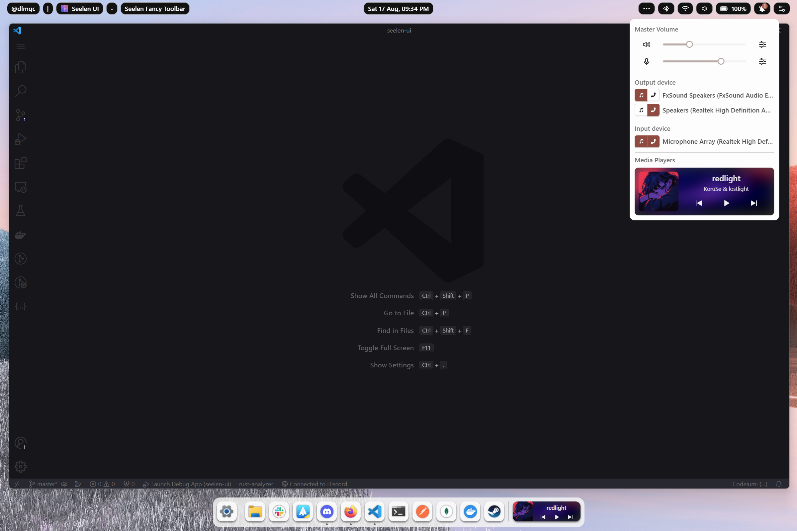

# Changelog

## [Unreleased]
### features
- discord rich presence.

### refactor
- icon packs implementation.
- changed react to preact.

### fix
- app crashing on start by missing user folder (desktop, pictures, etc).

## [2.3.8]
### enhancements
- show a warning to users with monitors drivers disabled.
- allow change workspace using wheel on toolbar.

### fix
- (#897) stucked arrival notifications.
- showing native notifications preview with the seelen ones (now only seelen arrival will be shown).
- (#934) invisible edge window on dock.
- (#925) invisible spotify widget on dock.
- (#938) listing 6ghz networks as 5g networks.
- (#962) JetBrains software isn't showing in dock.
- (#923) Can't change media device on MSIX version.

## [2.3.7]
### enhancements
- expose timeline on media players.
- reduce bundled size of js code.
- reduce verbosity on logs comming from widgets.

## [2.3.6]
### features
- widgets implementation.
- allow load/unload widgets via command line client.

### refactor
- improve internal code quality related to app console client.

### fix
- app not starting on start-menu cache corruption.
- widgets being reloaded on ctrl + r.

## [2.3.5]
### fix
- settings by monitor not working correctly.

## [2.3.4]
### enhancements
- sort windows on dock by activation order.

### fix
- duplicated themes on settings GUI.
- bad toolbar color on multiple maximized windows.

## [2.3.3]
### features
- add open window label on dock for app items (configurable).
- add input to write custom text items on the toolbar.
- add export resource button on developer tools.
- allow settings by theme.

### enhancements
- Settings UI refactor to follow the new resources ecosystem.
- (#838) Improve dynamic color behavior on toolbar.

### fix
- not removing old icons mask on icon pack change.
- styles for dock media item.
- not scrollable dock on overflow (many items).
- media player not being correctly updated on player close event.
- (#636) input experience and another background process appearing on dock.

## [2.3.2]
### enhancements
- mini performance improve on dock.

### fix
- resources not being updated correctly.

## [2.3.1]
### breaking changes
- rename scope variables for toolbar plugins.

### refactor
- improve inner code quality on toolbar plugins.

### enhancements
- improve robustness on toolbar items to avoid blue screen.

## [2.3.0]
### breaking changes
- remove mathjs eval by an more accurated eval for js code in toolbar plugins. This will break any plugin created before v2.2.10.

### features
- add resources endpoint to home tab on settings.
- add customizable and reusable popups implementation.
- improvements on toolbar plugins system.
- allow set buttons with custom actions on toolbar, via toolbar plugins.
- add restore to default button for toolbar structure.
- allow fetching remote data on toolbar plugins.

### enhancements
- reduce CPU usage on slu-service process.
- improve ui on toolbar modules.

### fix
- media player styles on toolbar.
- steam pin item on dock not working properly.
- plugins not being updated on toolbar.

## [2.2.9]
### enhancements
- store service logs in a file to help debugging.
- wait for native shell on startup before start seelen ui.

## [2.2.7]
### fix
- dock items not opening correctly.

## [2.2.6]
### feature
- icons on icon packs now can declare a mask that could be used by themes.

### enhancements
- add custom icons to bluetooth devices.
- allow set different icons by color scheme (light or dark) on icon packs.

### fix
- no dragable dock files and folders.
- focusing widgets on creation.
- not opening settings window when starting the app with an instance already running.

## [2.2.4]
### enhancements
- add suspend/resume logic.

### fix
- not restoring native taskbar on close/crash.
- clear all notifications button not updating UI.
- not translated date on chinese and norwegian.

## [2.2.3]
### enhancements
- wrap webview console as soon as posible to avoid missing errors on logs.
- wait some seconds before remove media players to avoid shifting on chrome.

### refactor
- remove minified classnames and add do-not-use prefix to be clear to users.

### fix
- panic on media module when loading initial devices.
- discord window without umid (for now umid was hardcoded).
- focused app not updating on title change.
- not considerating accesibility text scale factor on toolbar and dock.
- wheel not changing volume level.
- clear all notifications button not working correctly.

## [2.2.2]
### enhancements
- add option to disable dynamic colors on toolbar.
- reduce notification arrival time on screen from 10 seconds to 5 seconds.

### fix
- not showing some notifications.
- crash when disabling a monitor on windows native settings.
- unsyncronized clock on toolbar.

## [2.2.1]
### enhancements
- add new bundled theme as example of animated icons with css.

## [2.2.0]
### features
- add option to disable app thumbnail generation (dock).
- allow lock the dock/toolbar items.
- show instances counter of the same app on dock.
- allow set the toolbar on different positions.
- allow set custom start menu icon.
- language selector for toolbar.
- add dynamic color by focused app on toolbar.
- add hibernate button on toolbar power menu.
- add media volume mixer by apps and by device.
- add clickable notifications, images, and more.

### enhancements
- settings shown each time on startup.
- expand power module with power plan.

### refactor
- update windows-rs crate to 0.59.0.

### fix
- showing domain on username for local accounts.
- showing application frame host instead real app name.
- incorrect event order on win events.

## [2.1.9]
### fix
- shortcuts not working on MSIX.
- empty username for local accounts.

## [2.1.8]
### features
- add button to clear the cached icons on settings.

### enhancements
- allow custom icons by extension on icon packs.

### fix
- error on file icons.
- fix blue screen on toolbar when errors on template evaluation.

## [2.1.7]
### fix
- power module not clickable on toolbar.
- pinned items not working correctly for some apps.
- electron apps without aumid.

## [2.1.6]
### fix
- missing translations.
- fullscreen match not beeing removed.

## [2.1.5]
### fix
- devices and battery not clickables on toolbar.
- missing icon on dock media module while not playing.
- msix store not showing admin prompt.
- links on settings not opening.

## [2.1.4]
### fix
- crash on user module.
- slow loading of toolbar.
- no icons on PWA from edge browser.
- icon packs not modifying icons on toolbar/dock media modules.
- icon packs bad ordering, now the priority order is (umid > full-path > filename > extension).
- bad dock execution path on apps with property store umid but no shortcut on start menu.

## [2.1.3]
### fix
- bad user infomation on user module.

## [2.1.2]
### fix
- style issue on toolbar user module.
- showing unhandable tray icons (ex: nvidia old control panel).
- installer being frozen on update.

## [2.1.0]
### features
- allow custom animations on popups/dropdowns.
- show open new window buttons on dock app items context menu.
- toggle dock items using win + number.
- notifications count on dock app items.
- add brightness slider to quick settings on toolbar.
- add user module on toolbar.

### refactor
- create separated system service to handle elevated actions.

### fix
- ghost windows caused by a refactor donde on v2.0.13.
- not showing save button after icon packs change.
- app failing when powershell is not part of the $PATH enviroment.
- dock items no updatings paths on store updates.
- unremovable workspace module on toolbar.
- missing system tray icons.
- date not being inmediately updated on settings change.
- ghost notification hitbox preventing mouse events on windows.

## [2.0.14]
### hotfix
- not creating the default (system) icon pack.

## [2.0.13]
### features
- add kill process option on context menu for dock items.
- multi-language calendar and date module on toolbar.
- add icon packs selector on settings > general.
- allow show only windows on monitor owner of Dock/Taskbar.

### enhancements
- allow search languages by their english label.

### refactor
- move dock state to the background.
- remove pin sub-menu on dock.

### fix
- slu-service was being closed on exit code 1.
- logging errors on monitor changes.
- duplicated items on dock after drag items.

## [2.0.12]
### fix
- msix version crashing on start.

## [2.0.11]
### features
- add new setting on dock and toolbar to maintain overlap state by monitor.
- add service to restart the seelen-ui app on crash.

### enhancements
- force run the app as an APPX if it was installed using msix.

### refactor
- custom http server to serve files instead bundle it in the executable on development (local).

### fix
- remove ghost settings window from dock.

## [2.0.10]
### fixes
- fix settings `cancel` button not working correctly.
- fix settings `save` button not saving the monitor settings correctly.

## [2.0.9]
### enhancements
- add `XboxGameBarWidgets.exe` to the bundled apps settings list.

### refactor
- themes now use widget ids instead hard-coded keys.
- improvements on events propagation.
- improvements on settings by monitor implementation.

### fix
- window manager not working properly.
- resolution, scale changes not refreshing the UI.

## [2.0.8]
### enhancements
- add task manager shortcut on toolbar and dock context menu.
- improve default no media style on dock.
- add icons to context menus.

### fix
- randomized wallpaper slice freeze.
- bad behavior on context menus and popups.

## [2.0.7]
### fix
- crashing on fresh installations.

## [2.0.6]
### feature
- add bases for future plugins and widgets sytems.
- change wallpaper randomly.

### enhancements
- some UI/UX improvements on seelen wallpaper manager.
- UI/UX improvements on wi-fi toolbar module.
- seelen-ui added to user PATH enviroment variable.

### fix
- popups and context menus fast flashing.
- media player app not appearing on media module (weg & toolbar).
- touch looking the cursor.
- improve start up failure behavior.

## [2.0.5]
### features
- allow change default output volume using mouse wheel on media module items.
- add mini calendar to date module.

### enhancements
- add new settings to delay the show and hide of dock and toolbar.

### fix
- dock and toolbar animations
- fix update notifications for release and nightly channels.

## [2.0.4]
### fix
- app crashing when changing settings on app launcher.
- app previews on wrong position on dock.

## [2.0.3]
### fix
- apps being runned as admin instead normal.

## [2.0.2]
### fix
- infinite render loop on settings home page, fetching news.

## [2.0.1]
### refactor
- unification of SeelenWeg pinned files, folder and apps in a single structure.

### enhancements
- improve open_file function to allow arguments.
- allow to users select update channel between release, beta and nightly.

### fix
- not getting icons directly from .lnk files.
- users not recieving update notification on settings header.
- start-menu item on dock not closing native start menu.
- default theme wallpaper showing cut on ultra-wide monitors.

## [2.0.0]
### breaking changes
- Window Manager Layout Conditions was reimplemented, old conditions (v1) will fail.

### refactor
- refactors, more and more refactors, refactors for everyone.
- reimplementation of Tiling Window Manager.
- remove Update modal at startup by an update button on settings.

### features
- make the dock/taskbar solid when hide mode is `never`.
- add app launcher (rofi for windows).
- add seelen wall (rain-meter and wallpaper engine alternatives).
- expose function to pin items into the dock.
- settings by monitor.
- window manager multimonitor support.
- allow users change date format directly on UI settings.
- add context menu to toolbar items.

### enhancements
- improve quality icons from all app/files items.
- improve init loading performance.
- improve fullscreen matching system.
- reduce UI total size from 355mb (v1) to 121mb (v2-beta4) to 93mb (v2-beta8).
- reduce Installer size from 75mb (v1) to 40mb (v2-beta4) to 28.8mb (v2-beta8).
- allow drop files, apps and folders into the dock to pin them.
- now Virtual Desktop shortcuts doesn't require Tiling WM be enabled to work.
- now Themes are wrapped in a CSS layer, making easier the override theming.
- allow change size of Window Manager Layouts via window resizing with the mouse.
- allow close windows by middle clicking on dock items.
- show icon of app in media players that are not uwp/msix.
- show pwa apps like a separeted app from browser on dock.

### fix
- missing icons for files with a different extension than `exe`.
- losing cursor events on clicking a dock item.
- app allowing be closed via Alt + F4.
- native taskbar being hidden regardless of whether the program starts successfully or not.
- app continuing running when the program fails to start (case: WebView2 Runtime not installed).
- no stoping correctly secondary processes/threads on app close.
- showing unmanageable windows on dock.
- restart seelen-ui button not working properly.
- tray icons not working on others language than english.
- edge tabs open in file explorer.

## [1.10.6]
### fix
- tray module only working when the system language is english.

## [1.10.5]
### fix
- app crashing on IMMDevice disconnection.

## [1.10.4]
### enhancements
- clean weg items on load to remove duped items and apps/files that don't exist.
- remove 1/2px thickness border on window manager border.
- remove 1/2px black border on some previews of apps.

### fix
- can not restore settings window.
- taskbar not been restored when changing weg enabled state.
- taskbar been restored always as not autohide, now it will restored as initial state.

## [1.10.3]
### features
- add beta channel

### enhancements
- add debugger cli toggles to tracing more info on logs.
- media modules now exports the app related to the media player.

### fix
- saving ahk lib in wrong location.

## [1.10.2]
### fix
- app crashing on enumerating many monitors or on large load.

## [1.10.1]
### fix
- app crashing if uwp package has missing path.
- app no working fine on multiple monitors.

## [1.10.0]
### features
- add volume changed popup.
- new custom virtual desktop implementation.
- shortcut to toggle debug mode on hitboxes (Control + Win + Alt + H).

### enhancements
- remove black borders of windows previews on dock.
- improve uwp app manage on dock/taskbar.

### refactor
- add strategy pattern to virtual desktops.

### fix
- topbar hitbox rect on auto hide equals to on-overlap.
- bad matching fullscreen apps.
- suspended process (ex: Settings) been shown on dock.
- uwp icons not loading correctly.
- bad focused app matching strategy.

## [1.9.11]
### features
- add a option to hide apps from the dock/taskbar, requested on #5.
- update tray labels when tray icons module are open.
- add auto-hide option to the toolbar.

### fix
- route no maintaining on cancel changes on settings window.
- cancel button no working correctly after save the settings multiple times.
- tray module no forcing tray overflow creating on startup.
- native taskbar not been restored on close.

## [1.9.10]
### features
- add `getIcon` fn to the scopes of toolbar placeholders.

### refactored
- improve interfaces and documentation.

### fix
- styles of media module when dock is on left side.
- opened apps been removing on weg items file change.
- app crashing on update if language prop was null in the settings.json file.

## [1.9.9]
### refactored
- internal interfaces to improve documentation and development.

### enhancements
- add language selector to the nsis installer.
- allow search on lang selector on Seelen UI Settings.

### fix
- app no opening to new users.

## [1.9.8]
### enhancements
- avoid recreate already existing folders.
- separate lib and app in two crates.
- improve click behavior on seelen weg item to make it more intuitive.

### fix
- can no disable run on startup.
- text been cut on toolbar.
- app crashing on wallpaper change on win11 24h2

## [1.9.7]
### enhancements
- made all invoke handlers async

### fix
- crash on registering network event

## [1.9.6]
### fix
- app crashing on 24h2

## [1.9.5]
### fix
- app crashing by tray icon module

## [1.9.4]
### fix
- app crashing for new users

## [1.9.3]
### performance
- reduce load time from ~7s to ~4s

### features
- .slu and uri now are loaded correctly on seelen ui.
- allow change wallpaper from seelen settings.

### enhancements
- add file associations for .slu files
- add uri associations for seelen-ui:uri
- improve settings editor experience by adding live reload feature.

### fix
- cli no working on production

## [1.9.1]
### fix
- no listening window moving of virtual desktop events.
- no closing or starting widgets on settings changes.
- no listening monitors changes.
- no loading toolbar modules on wake up

## [1.9.0]
### features
- allow custom images on toolbar by `imgFromUrl`, `imgFromPath` and `imgFromExe` functions.
- add notifications module to toolbar.
- add exe path to window in generic module for toolbar.
- add focused window icon to default toolbar layouts.

### enhancements
- icons now are recreated from exe path if icon was deleted.
- uwp icons now are loaded from background.
- improvements on themes selector.
- improvements on system color detection and expose more system colors based in accent gamma.
- improve theme creation experience by adding live reload feature.
- improve toolbar layouts (placeholders) creation experience by adding live reload feature.
- improve weg items editor experience by adding live reload feature.

### refactor
- deprecate `onClick` and add new `onClickV2` on toolbar modules.

### fix
- bad translations keys.
- no restoring dock on closing fullscreened app.

## [1.8.12]
### fix
- app installed by msix no opening.

## [1.8.11]
### fix
- remove unnecessary 1px padding on toolbar.

## [1.8.10]
### enhancements
- remove unnecessary loop on taskbar hiding function.

### fix
- no loading translations correctly on update modal.

## [1.8.9]
### enhancements
- add translation to the rest of apps (dock, toolbar, and update modal).

### fix
- not hiding the taskbar at start.
- opening multiple instances of the app.

## [1.8.8]
### fix
- app not running on startup

## [1.8.7]
### fix
- no updating themes on changes saved.

## [1.8.6]
### features
- Add multi-language support! 🥳.
- Add default media input/output selectors to media module in fancy toolbar.
- Add start module to dock/taskbar (opens start menu).

### enhancements
- Flat default themes to allow easier overrides.

### fix
- Fix zorder on hovering on weg and toolbar respectively to wm borders.
- Applying bad themes on apps.
- Not hiding the taskbar at start.

## [1.8.5]
### fix
- no executing seelen after update installation

## [1.8.4]
## [1.8.3]
### refactor
- migrate settings files from `$USER/.config/seelen` to `$APPDATA/com.seelen.seelen-ui`
- load uwp apps info asynchronously

### fix
- crash on move toolbar item
- can not remove media module

## [1.8.2]
### features
- fancy toolbar items now can be dragged of position.
- using fancy toolbar's layout now can be modified and saved as custom.yml.

## [1.8.1]
### features
- styles can be specified in fancy toolbar placeholder item.
- fancy toolbar item now will have an unique id, this can be specified in the placeholder file.

### enhancements
- replace "bluetooth" for "devices" on bundled fancy toolbar placeholders.

## [1.8.0]
### features
- Media module added to the toolbar.
- Media module added to SeelenWeg.

  

- SeelenWeg now has a context menu (Right Click Menu).

### enhancements
- enhancements on fullscreen events.

### refactor
- remove Default Wave animation on seelenweg (users will be able to add their own animations).

### fix
- no updating colors correctly on change light or dark mode on windows settings.
- window manager enabled by default for new users.
- showing tray icons with empty name.
- no focusing seelen settings if it was minimized.

## [1.7.7]
### fix
- no registering system events (battery/network/etc)

## [1.7.6]
### enhancements
- improve logging on dev mode and fix missing target on production logged errors.
- improve fullscreen matching.

### fix
- network icon showing incorrect interface icon (lan instead wifi).
- no updating adapters list and using adapter on network changes.

## [1.7.5]
## [1.7.4]
### enhancements
- improvements on workflows to auto upload artifacts to the store.

## [1.7.3]
### enhancements
- improvements on fullscreen events.

## [1.7.2]
### enhancements
- disable tiling window manager on windows 10 from UI (can be forced on settings.json file)

### fix
- app crashing on windows 10
- empty tray icons list on windows 10

## [1.7.1]
### enhancements
- separate `information` and `developer tools` tabs in the settings.
- add a option to open the install path in explorer.
- focus settings window if already exist.
- better performance on canceling changes in settings.
- avoid loading innecesary files in modules that are not used.
- update pinned apps path by filename on open (some apps change of path on updates so this will fix that).
- show empty message on toolbar when no wlan networks are found.

### fix
- ahk error on save.

## [1.7.0]
### features
- add Network toolbar module.
- add WLAN selector to the Network toolbar module.
- add css variable (--config-accent-color-rgb) to be used with css functions like `rgb` or `rgba`.

### enhancements
- now placeholders, layouts and themes can be loaded from data users folder (`AppData\Roaming\com.seelen.seelen-ui`)
- now buttons and others components will use the user accent color.

### fix
- no max size on System Tray List module.

## [1.6.4]
### fix
- xbox games showing missing icons on SeelenWeg.

### enhancements
- follow user accent color for tray list and windows borders

### fix
- no showing promoted (pinned on taskbar) tray icons.
- toolbar no initialized correctly sometimes, now will retry if fails.
- battery no updating level.
- battery showing as always charging on default toolbar templates.
- tray overflow module no working on different languages.

### refactor
- refactor on window_api and AppBar structures.

## [1.6.3]
### enhancements
- only show a progress bar on update and not the complete installer GUI.

### fix
- main app no running if the forced creation of tray overflow fails.

## [1.6.2]
### features
- now `batteries` and `battery` (same as: `batteries[0]`) are available on the scope of power toolbar module.

### enhancements
- add battery crate to handle batteries info directly from their drivers.
- show if is smart charging.
- now battery module wont be shown if batteries are not found.

### fix
- battery showing 255%.

## [1.6.1]
### fix
- tray icons not showing on startup
- hidden trays if icon was not found (now will show a missing icon)

## [1.6.0]
### features
- add "Run as admin" option at context menu on Seelenweg. 
- allow receive commands using TCP connections.
- Add System Tray Icons module, (incomplete, devices like usb or windows antivirus trays are still not supported).

### enhancements
- improve power (battery) events performance.
- Window manager disabled by default to new users.

### refactor
- remove tauri single instance plugin by TCP connection.

## [1.5.0]
### features
- new placeholder added to the bundle as alternative to default.
- new workspace item available to be used in placeholders.

### enhancements
- support fullscreen apps (will hide the toolbar and the weg on fullscreen an app).

### fix
- showing incorrect format on dates at start of the app.
- complex text with icons on toolbar items cause wraps.
- missing icons on some uwp apps.

### refactor
- refactor on window event manager to allow synthetic events.

## [1.4.1]
### fix
- no truncating text on toolbar items overflow.
- rendering empty items on toolbar when empty placeholder is declared.

## [1.4.0]
### features
- Modular Themes
- Themes now allow tags to be categorized.
- Allow add, organize, combine multiple themes as cascade layers.
- Themes now allow folder structure to improve developers experience.

### refactor
- Now themes will use .yml files instead json to improve developers experience.
- Themes schema updated, no backwards compatibility with json themes. (.json in themes folder will be ignored)

### fix
- No hiding the taskbar correctly.

## [1.3.4]
### enhancements
- Add splash screen to Settings window.
- Add discord link on Information Section.

### refactor
- Use TaskScheduler for autostart Seelen with priority and admin privileges.

### fix
- bad zorder on Weg and Toolbar under the WM borders

## [1.3.3]
### features
- Multi-monitor support for Fancy Toolbar.
- Multi-monitor support for Seelenweg.

## [1.3.2]
### enhancements
- Remove unnecessary tooltip collision on toolbar items.

### fix
- Crash on restoring app in other virtual desktop using Weg.
- Touch events not working on Toolbar and Weg.

## [1.3.1]
### fix
- disable binding monitors and monitors on apps configurations for now.

## [1.3.0]
### features
- Allow pin apps on Open using Apps Configurations.
- Allow changes Shortcuts using UI.
- Allow Binary Conditions in Apps Configurations Identifiers.
- Allow change the Auto hide behavior for Seelenweg.

### enhancements
- Close AHK by itself if app is crashed or forcedly closed.
- Configurations by apps are enabled again.
- Allow open settings file from Extras/Information
- Add opacity to toolbar (theme: default)

### fix
- Ahk not closing on app close or when user change options.

## [1.2.4]
### enhancements
- Automatic MSIX bundle.
- Add Github Actions for Releases.
- Add Github Actions for Web Page.

## [1.2.3]
### features
- Allow customize Fancy Toolbar modules using placeholders yaml files.
- Add fast settings for toolbar allowing to adjust volume, brightness, etc.

## [1.2.2]
### enhancements
- if app on weg is cloak, change of virtual desktop instead minimize/restore

### fix
- no closing AHK instances
- floating size on fallback
- reservation not working properly
- ignore top most windows by default (normally these are tools or widgets)
- minimization on weg not working properly if window manager is activated
- change focus using commands not working with conditional layouts
- randomly frozen app on start
- no tiling UWP apps

## [1.2.1]
### enhancements
- Allow quit from settings
- Using Box-Content style in the position of windows instead outlined for a better user experience

### fix
- Managing windows without caption (Title bar)
- can't update border configurations
- hiding dock on switching virtual desktops

## [1.2.0]
### fix
- Taskbar showing instead be always hidden

## [1.1.1]
### fix
- Bad download URL in Update Notification
- Showing update notification on installations by Windows Store

## [1.1.0]
### features
- Add Smart Auto Hide for Seelenweg.
- Add visible Separators Option
- Enable animations for items into LEFT, TOP, RIGHT positions

### enhancements
- Now the copy handles option will return hexadecimal handles instead decimal (good for faster debug in tools like spy++).

### fix
- duped handles
- inconsistencies in separators width

## [1.0.1]
### fix
- App downloaded form Microsoft Store was not running without admin.

## [1.0.0]
### refactored
- Update notifications always enabled for nsis installer
- Update notifications will not appear if app is installed using msix (Microsoft Store).

### enhancements
- Now by default if user is Admin, UAC will be triggered on run the app to allow a better integrated experience in SeelenWeg and Komorebi Tiling Manager.

## [1.0.0-prerelease.14]
### features
- add indicator to know opens and focused apps on SeelenWeg
- allow set the position of seelenweg (left, top, right, bottom) 🎉

### enhancements
- only creates app icons the first time they are loaded

### refactor
- change themes implementation to allow customs css files

### fix
- incorrect icon for UWP (was using store icon instead taskbar icon)
- replacing icons on each load
- showing logs of opened apps on development
- offset margins working like windows RECT instead like one side margins

## [1.0.0-prerelease.13]
### features
- add Themes Feature 🎉 (incomplete only for Seelenweg for now)
- add SeelenWeg (a Dock or Taskbar) beta feature
- add SeelenWeg in to Settings
- add ContextMenu for apps in SeelenWeg
- allow move apps in the Weg 😄
- add Grouped Apps in one item
- live reload of Apps on events like change of title
- UWP apps support

### enhancements
- move readme blob to documentation/images

## [1.0.0-prerelease.12]
### enhancements
- add some traces on functions to save logs

### fix
- clean installation of komorebi no working

## [1.0.0-prerelease.11]
### refactor
- little improvements on background code

### fix
- initial users can not save the settings

## [1.0.0-prerelease.10]
### features
- add a update tab to allow users decide if will receive notifications for updates

## [1.0.0-prerelease.9]
## [1.0.0-prerelease.8]
- add functionality to pause btn on tray menu

## [1.0.0-prerelease.6]
### added
- Enable Updater 🎉

## [1.0.0-prerelease.3]
### fix
- icon not showing on tray
- poor icon quality on task bar
- StartUp running bad exe file

## [1.0.0-prerelease.2]
## [1.0.0-prerelease.1]
### added
- implement tray icon

### refactored
- Migrate all app background from Electron ⚡ to Tauri 🦀
- reimplement startup to use native system startup
- reimplement included shortcuts with ahk
- reimplement komorebi autostart
- reimplement installer to use NSIS
- refactor folder structure to isolate front-end apps

## [1.0.0-beta.13]
### enhancements
- improve maximized windows experience

### fixed
- fix resize not working (now works like master)

## [1.0.0-beta.12]
### added
- show current used versions on information
- add grid layout preview
- add win + k to open komorebi settings

### refactored
- update komorebi to 0.1.22

### removed
- remove invisible borders feature

## [1.0.0-beta.11]
### fixed
- missing property on schema
- white screen on start app

## [1.0.0-beta.10]
### added
- add a new way to match applications by path

### fixed
- searching feature on apps
- no focusing windows on change workspace
- autostacking not working properly
- workspaces rules not working

## [1.0.0-beta.9]
### added
- add popups on actions 🦀
- now can switch from installed and packaged and should work as the same

### fixed
- fix no removing old path
- lag on many applications

## [1.0.0-beta.8]
### added
- add more templates

## [1.0.0-beta.7]
### fixed
- fix first install

## [1.0.0-beta.6]
### added
- delete old paths on update

### fixed
- fix not saving templates
- fix toggle ahk shortcuts does not run or stop the instance
- running ahk when disabled
- not updating the path of installation folder on update for windows tasks

## [1.0.0-beta.5]
### added
- new searching option for applications
- templates feature

### fixed
- including ghost apps on migration

## [1.0.0-beta.4]
### added
- new feature of invisible borders per app
- new easy way to hard restart the services and AHK

### changed
- delete border overflow and changed for invisible borders per app

### fixed
- components was not triggering dark mode correctly

## [1.0.0-beta.3]
### added
- new apps templates
- add AHK as a dependency to show to new users
- add AHK settings

## [1.0.0-beta.2]
### added
- export option for apps

### fixed
- delete bound monitor and workspace on an application
- bad installation on setup