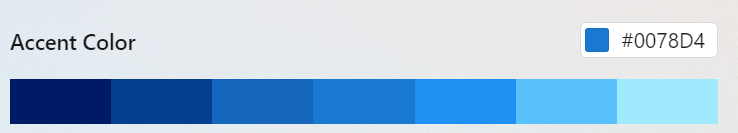

# Themes

In Seelen UI, themes are managed as layers, allowing multiple themes to be used simultaneously. Since themes are like CSS files, their order is crucial as it determines the cascade order.

Themes can be either a single file or a folder containing a specific file. The file should be a `.yml` file that adheres to the [theme schema](./schemas/theme.schema.json).

For a folder, it follows this structure. Instead of using `styles.{module}` in the metadata file, it uses a CSS file named `theme.{module}.css`:

```
C:\Users\{USER}\AppData\Roaming\com.seelen.seelen-ui\themes
└── YourThemeFolder         # Name of your theme
    ├── theme.yml           # Theme metadata file
    ├── theme.weg.css
    ├── theme.toolbar.css
    └── theme.wm.css
```

**Note:** the file name or the folder name is used as the identifier of the theme.

## Examples
You can use the default themes included in the executable as a guide. See the [themes](../static/themes/) directory in the code as example.

## System Colors

Seelen UI exposes system colors through CSS variables, such as:

* `--config-accent-color`: This is a hex color without alpha, e.g., `#ffbbaa`.
* `--config-accent-color-rgb`: This represents RGB color values, e.g., `255, 187, 170`. It can be used in CSS as `rgba(var(--config-accent-color-rgb), 0.5)`.

Complete list of system color variables:

* `--config-accent-darkest-color`
* `--config-accent-darkest-color-rgb`
* `--config-accent-darker-color`
* `--config-accent-darker-color-rgb`
* `--config-accent-dark-color`
* `--config-accent-dark-color-rgb`
* `--config-accent-color`
* `--config-accent-color-rgb`
* `--config-accent-light-color`
* `--config-accent-light-color-rgb`
* `--config-accent-lighter-color`
* `--config-accent-lighter-color-rgb`
* `--config-accent-lightest-color`
* `--config-accent-lightest-color-rgb`

All these are variants of the accent color set in your system settings.



## Other Colors

All the colors listed in the following [Gist](https://gist.github.com/eythaann/cd9a3cda0206ce23a17f5ea00ec2ba06) are also exposed for use in your themes.
