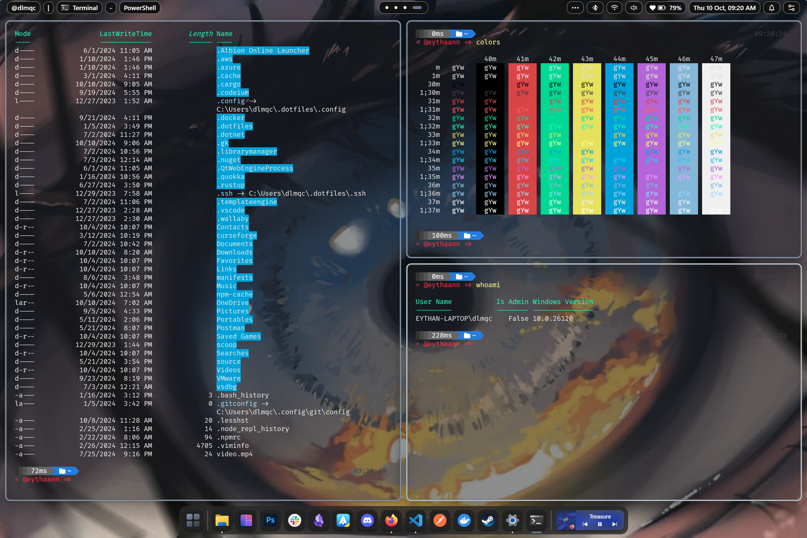

# Tiling Window Manager

## What is a Tiling Window Manager?

A Tiling Window Manager (TWM) is a window manager that automatically organizes applications into non-overlapping tiles
instead of overlapping them. This optimizes screen space and simplifies application navigation through keyboard
shortcuts.

### Why Should You Consider Using It?

- **Spatial Efficiency:** Maximize your screen real estate, allowing you to work with multiple applications without
  overlapping.

- **Enhanced Productivity:** Quickly navigate between applications with keyboard shortcuts and easily split the screen
  for efficient multitasking.

- **Total Customization:** Tailor window arrangement and keyboard shortcuts according to your preferences.

- **Seamless Experience:** Eliminate visual distractions by avoiding overlapping windows.

In summary, a Tiling Window Manager can transform your computing experience, offering spatial efficiency, enhanced
productivity, and an interface tailored to your needs. If you value space optimization and agility in navigating between
applications, consider making the switch!
