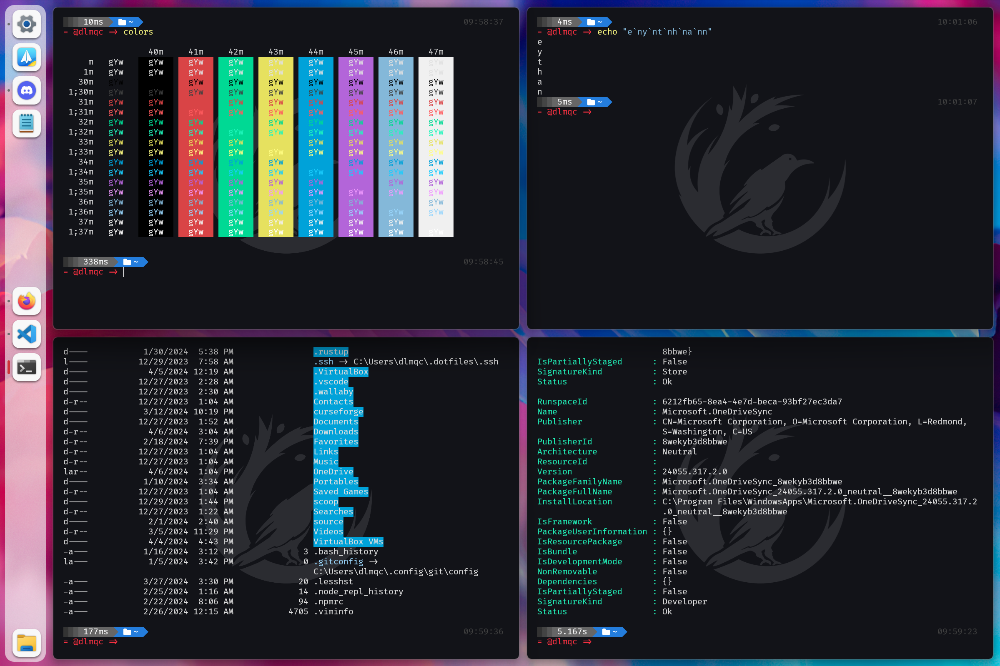

## Overview
Welcome to Seelen UI, where customization meets productivity, revolutionizing your Windows desktop experience. Seamlessly integrated into your system, Seelen UI unlocks a world of possibilities, offering an extensive array of customization features to sculpt your desktop into a personalized masterpiece of efficiency and style.

* **Unleash Your Creativity**: With Seelen UI, your desktop becomes a canvas, ready for your creative vision. From menus to widgets, every element can be tailored to reflect your unique style and workflow.

* **Boost Your Productivity**: Say goodbye to clutter and hello to organization. Seelen UI empowers you to streamline your desktop layout, ensuring that essential tools and information are always at your fingertips. Plus, with a Tiling Windows Manager for Windows, productivity reaches new heights as windows automatically arrange themselves for optimal multitasking efficiency.

  

* **Easy and Very Customizable Configuration**: Seelen UI offers an easy and highly customizable configuration through an intuitive user interface. Tweak every aspect of your desktop experience with ease, from colors and fonts to taskbar layouts and icon arrangements, all within a few clicks.

  

## Getting Started - Installation
You can choose from different installation options based on your preference:

### Microsoft Store (recommended)
Download the latest version from the [Store](https://www.microsoft.com/store/productId/9P67C2D4T9FB?ocid=pdpshare) page this is the recommended option because you will recieve updates, and a secure version of the program.

#### Pay vs Free trial
There are no differences between them, both the paid version and the free trial offer exactly the same features. The option to purchase is simply a way to donate and support my work in developing this application.

### Installer (Setup.exe)
Download the latest version from the [Releases](https://github.com/eythaann/seelen-ui/releases) page and run the `setup.exe` installer. This will notify for new updates but maybe is detected as virus because actually is not signed.

## Usage

Once installed or extracted, simply open the program. The easy-to-use and intuitive GUI will guide you through the configuration process. Customize your window management experience effortlessly.

For more detailed information and advanced features, refer to the [Seelen UI User Guide](documentation/user_guide.md).

## What is a Tiling Window Manager?

A Tiling Window Manager (TWM) is a window manager that automatically organizes applications into non-overlapping tiles instead of overlapping them. This optimizes screen space and simplifies application navigation through keyboard shortcuts.

### Why Should You Consider Using It?

- **Spatial Efficiency:** Maximize your screen real estate, allowing you to work with multiple applications without overlapping.

- **Enhanced Productivity:** Quickly navigate between applications with keyboard shortcuts and easily split the screen for efficient multitasking.

- **Total Customization:** Tailor window arrangement and keyboard shortcuts according to your preferences.

- **Seamless Experience:** Eliminate visual distractions by avoiding overlapping windows.

In summary, a Tiling Window Manager can transform your computing experience, offering spatial efficiency, enhanced productivity, and an interface tailored to your needs. If you value space optimization and agility in navigating between applications, consider making the switch!

## Contributing

We welcome contributions! Read the [Contribution Guidelines](CONTRIBUTING.md) to get started.

## License

This project is licensed under the MIT License - see the [LICENSE](LICENSE) file for details.

## Contact

For inquiries and support, please contact me.

Happy window managing and customization with Seelen UI!
