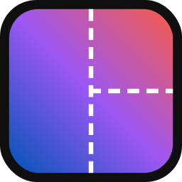
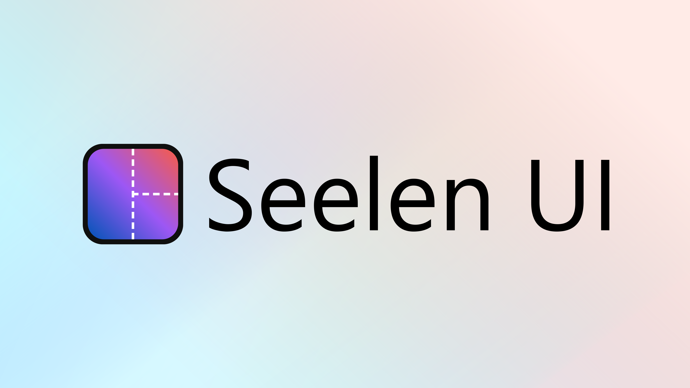
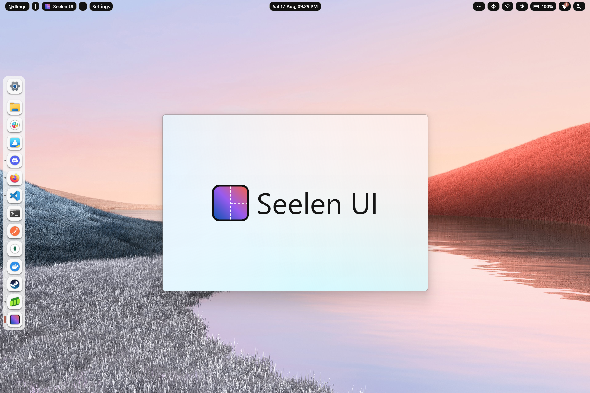

<h1 align="center">
  
  Seelen UI
</h1>

<h2 align="center">
  Fully Customizable Desktop Environment for Windows
  <br/>
  Available in 70+ Languages
</h2>

<div align="center"> 

[](https://github.com/eythaann/seelen-ui/graphs/contributors)
[](https://github.com/eythaann/seelen-ui/commits/main)
[](https://github.com/eythaann/seelen-ui/releases)
[](https://github.com/eythaann/seelen-ui/releases)

</div>


<table align="center">
  <tr>
    <td align="center">
      <a
        href="https://apps.microsoft.com/detail/Seelen%20UI/9p67c2d4t9fb?mode=full"
        target="_blank"
        rel="noopener noreferrer"
        aria-label="Download Seelen UI from Microsoft Store">
        
      </a>
    </td>
    <td align="center">
      <a
        href="https://discord.gg/ABfASx5ZAJ"
        target="_blank"
        rel="noopener noreferrer"
        aria-label="Download Seelen UI from Microsoft Store">
        
      </a>
    </td>
  </tr>
</table>

## Overview
Welcome to Seelen UI, where customization meets productivity, revolutionizing your Windows desktop experience. Seamlessly integrated into your system, Seelen UI unlocks a world of possibilities, offering an extensive array of customization features to sculpt your desktop into a personalized masterpiece of efficiency and style.

* **Unleash Your Creativity**: With Seelen UI, your desktop becomes a canvas, ready for your creative vision. From menus to widgets, every element can be tailored to reflect your unique style and workflow.

  

<br/>

* **Boost Your Productivity**: Say goodbye to clutter and hello to organization. Seelen UI empowers you to streamline your desktop layout, ensuring that essential tools and information are always at your fingertips. Plus, with a Tiling Windows Manager for Windows, productivity reaches new heights as windows automatically arrange themselves for optimal multitasking efficiency.

  
<br/>

* **Easy and Very Customizable Configuration**: Seelen UI offers an easy and highly customizable configuration through an intuitive user interface. Tweak every aspect of your desktop experience with ease, from colors and fonts to taskbar layouts and icon arrangements, all within a few clicks.

  
<br/>

## Getting Started & Installation
You can choose from different installation options based on your preference:

### Microsoft Store <em>(recommended)</em>
Download the latest version from the [Store](https://www.microsoft.com/store/productId/9P67C2D4T9FB?ocid=pdpshare) page. This is the recommended option because you will receive updates and a secure version of the program.

### Winget
Install the latest version using:

``` pwsh
winget install --id Seelen.SeelenUI
``` 
This option also uses the signed `.msix` package and ensures you have the latest secure version.

### .msix Installer
Download the `.msix` installer from the [Releases](https://github.com/eythaann/seelen-ui/releases) page. This package is signed, ensuring a secure installation.

### Setup.exe
Download the latest version from the [Releases](https://github.com/eythaann/seelen-ui/releases) page and run the `setup.exe` installer. This option is less recommended as the installer is not signed, which may cause it to be flagged as a potential threat by some antivirus programs.


## Usage

Once installed or extracted, simply open the program. The easy-to-use and intuitive GUI will guide you through the configuration process. Customize your window management experience effortlessly.

For more detailed information and advanced features, refer to the [Seelen UI Documentation](./documentation).

## Contributing

We welcome contributions!
* Read the [Contribution Guidelines](CONTRIBUTING) to get started with terms.
* Read the [Project Documentation](documentation/project.md) to understand the project structure and how to use it.

## License

See the [LICENSE](LICENSE) file for details.

## Contact

For inquiries and support, please contact me on [Discord](https://discord.gg/ABfASx5ZAJ).

## Thank You

Happy window managing and customization with Seelen UI!
