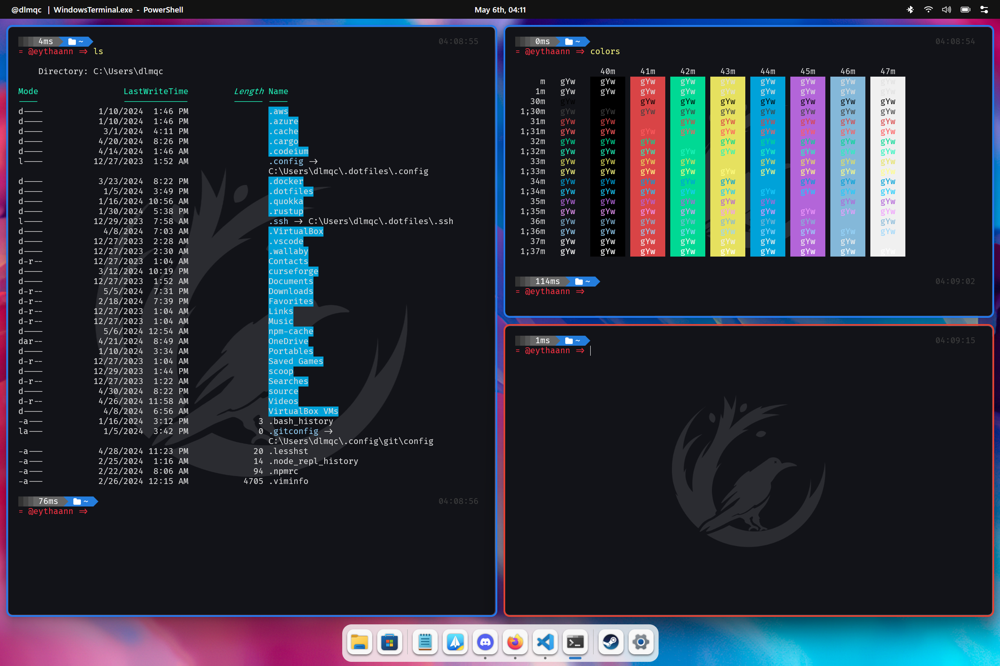

## Overview

Komorebi UI is a user-friendly fork of Komorebi, a tiling window manager for Windows. While the original Komorebi primarily offers a CLI (Command Line Interface) and may not be very accessible to non-programmers, Komorebi UI aims to provide a visually appealing, intuitive interface for users who may not have programming skills. This project enhances usability and aesthetic details while introducing additional features to make Komorebi more accessible.

### Features

- **User-Friendly Interface:** Designed with a focus on usability, ensuring a seamless experience for both novice and experienced users.

- **Visual Appeal:** Attention to aesthetic details to create an attractive and enjoyable interface.

- **Additional Functionality:** Includes extra features that enhance the overall usability of Komorebi.

### What is a Tiling Window Manager?

A Tiling Window Manager (TWM) is a window manager that automatically organizes applications into non-overlapping tiles instead of overlapping them. This optimizes screen space and simplifies application navigation through keyboard shortcuts.

### Why Should You Consider Using It?

- **Spatial Efficiency:** Maximize your screen real estate, allowing you to work with multiple applications without overlapping.

- **Enhanced Productivity:** Quickly navigate between applications with keyboard shortcuts and easily split the screen for efficient multitasking.

- **Total Customization:** Tailor window arrangement and keyboard shortcuts according to your preferences.

- **Seamless Experience:** Eliminate visual distractions by avoiding overlapping windows.

In summary, a Tiling Window Manager can transform your computing experience, offering spatial efficiency, enhanced productivity, and an interface tailored to your needs. If you value space optimization and agility in navigating between applications, consider making the switch!

## Getting Started

### Installation

You can choose from different installation options based on your preference:

#### Option 1: Installer (Setup.exe)

Download the latest version from the [Releases](https://github.com/eythaann/komorebi-ui/releases) page and run the `setup.exe` installer. This is the recommended method for a hassle-free installation experience.

#### Option 2: Portable Version (.zip)

If you prefer a portable version, download the `.zip` file from the [Releases](https://github.com/eythaann/komorebi-ui/releases) page. Extract the contents to a location of your choice, and you're ready to go.

### Usage

Once installed or extracted, simply open the program. The easy-to-use and intuitive GUI will guide you through the configuration process. Customize your window management experience effortlessly.

For more detailed information and advanced features, refer to the [Komorebi UI User Guide](documentation/user_guide.md).

## Deep Dive into the Maximalist Fork

Komorebi UI is not just a fork; it's a maximalist fork of the original Komorebi. This means that it deviates significantly from the simplicity of Komorebi, embracing a more feature-rich approach. Unlike a retrocompatible fork, Komorebi UI introduces additional features and is not backward compatible with the original Komorebi CLI.

### Key Differences

- **Maximalist Approach:** Komorebi UI takes a maximalist approach, providing a comprehensive set of features beyond the simplicity of the original Komorebi.

- **Enhanced Usability:** The user interface is designed to be more accessible, making it suitable for both developers and non-programmers.

- **Migration Assistance:** Despite the lack of retrocompatibility, Komorebi UI offers a smooth migration path for users coming from the Komorebi CLI. The GUI provides an easy transition, allowing users to leverage the power of Komorebi UI effortlessly.

### Why Maximalist?

The decision for a maximalist fork stems from the desire to offer a feature-rich experience. While the original Komorebi aims to be as simple as possible, Komorebi UI embraces complexity to provide a more versatile and powerful window management solution.

For more information on specific features and migration details, refer to the [Komorebi UI User Guide](documentation/user_guide.md).

## Contributing

We welcome contributions! Read the [Contribution Guidelines](CONTRIBUTING.md) to get started.

## License

This project is licensed under the MIT License - see the [LICENSE](LICENSE) file for details.

## Acknowledgments

- Thanks to the [original Komorebi project](https://github.com/LGUG2Z/komorebi) for laying the foundation.
- Special appreciation to [LGUG2Z](https://github.com/LGUG2Z) for their significant contributions.

## Contact

For inquiries and support, please contact me.

Happy window managing with Komorebi UI!
