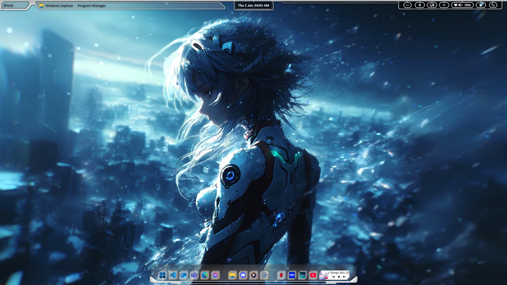
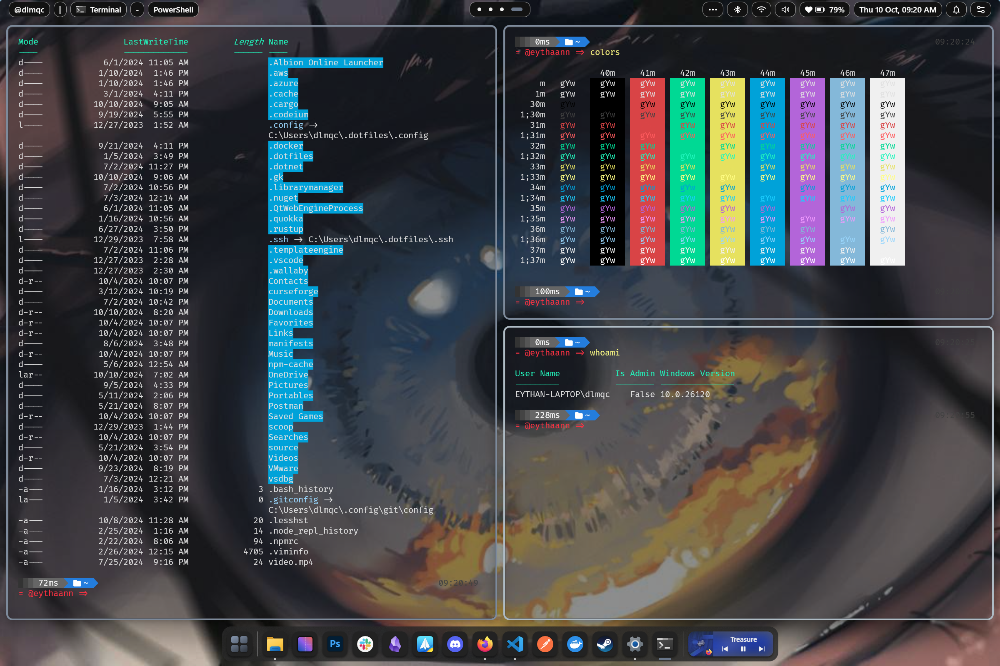
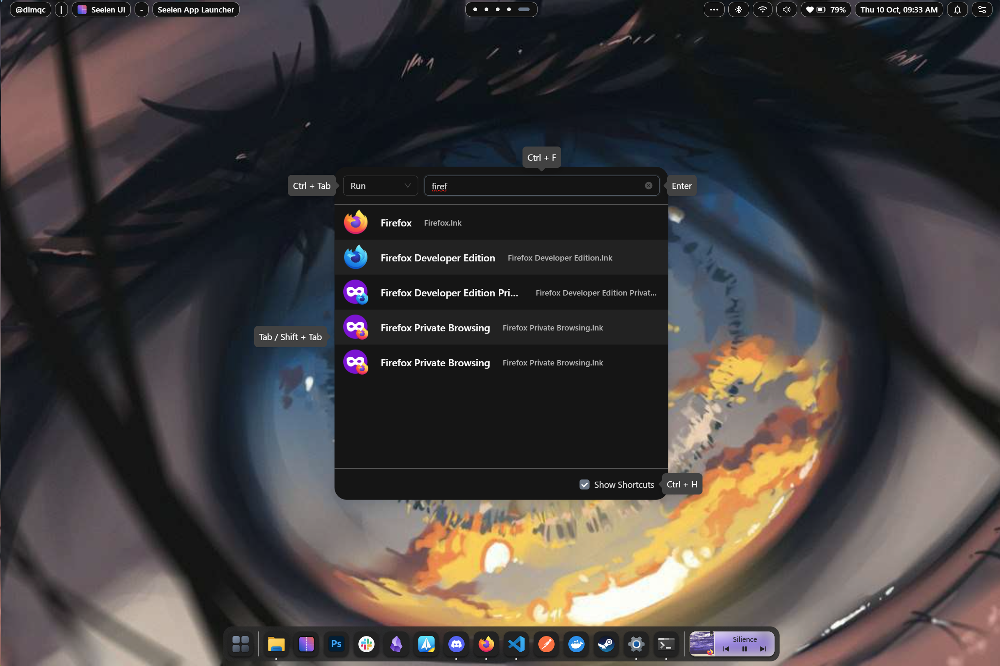
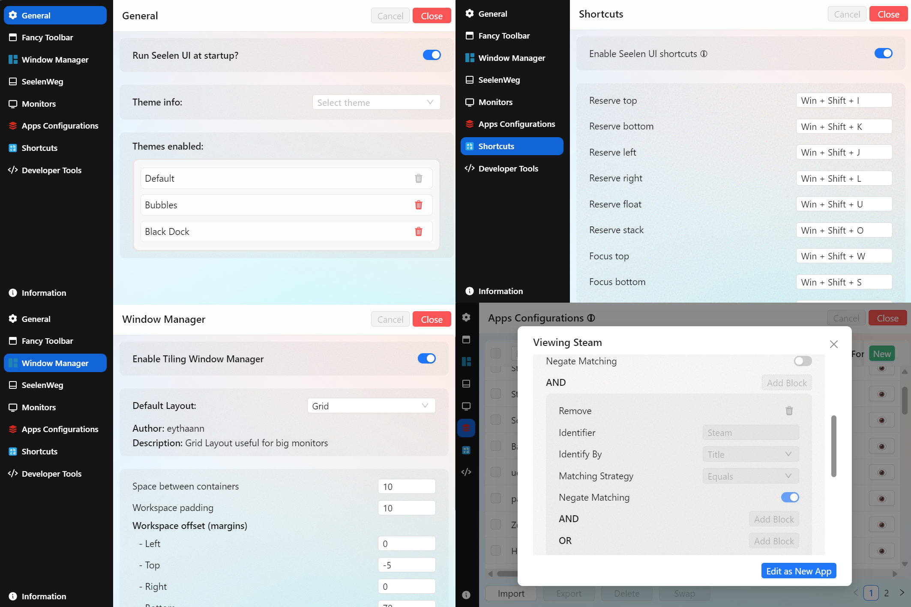

<h1 align="center">
  
  Seelen UI
</h1>

<h2 align="center">
  Fully Customizable Desktop Environment for Windows
  <br/>
  Available in 70+ Languages
</h2>

<div align="center"> 

[](https://github.com/eythaann/seelen-ui/graphs/contributors)
[](https://github.com/eythaann/seelen-ui/commits/main)
[](https://github.com/eythaann/seelen-ui/releases)
[](https://github.com/eythaann/seelen-ui/releases)

</div>


<table align="center">
  <tr>
    <td align="center" width="33%">
      <a
        href="https://apps.microsoft.com/detail/Seelen%20UI/9p67c2d4t9fb?mode=full"
        target="_blank"
        rel="noopener noreferrer"
        aria-label="Download Seelen UI from Microsoft Store">
        
      </a>
    </td>
    <td align="center" width="33%">
      <a
        href="https://discord.gg/ABfASx5ZAJ"
        target="_blank"
        rel="noopener noreferrer"
        aria-label="Join the Seelen UI Discord community">
        
      </a>
    </td>
    <td align="center" width="33%">
      <a
        href='https://ko-fi.com/O4O41ADV7D'
        target='_blank'
        rel="noopener noreferrer"
        aria-label="Buy me a coffee">
        
      </a>
    </td>
  </tr>
</table>

## Overview
[Seelen UI](https://seelen.io) is a tool designed to enhance your Windows desktop experience with a focus on customization and productivity. It integrates smoothly into your system, providing a range of features that allow you to personalize your desktop and optimize your workflow.

* **Be Creative**: Seelen UI lets you tailor your desktop to fit your style and needs. You can adjust menus, widgets, icons, and other elements to create a personalized and visually appealing desktop environment.

  

<br/>

* **Enhance Your Productivity**: Seelen UI helps you organize your desktop efficiently. With a Tiling Windows Manager, windows automatically arrange themselves to support multitasking, making your work more streamlined.
  
  

<br/>

* **Enjoy your music**: With an integrated media module that's compatible with most music players, Seelen UI allows you to enjoy your music seamlessly. You can pause, resume, and skip tracks at any time without the need to open additional windows.
  
  

<br/>

* **Be faster!**: With an app launcher inspired by Rofi, Seelen UI provides a simple and intuitive way to quickly access your applications and execute commands.

  

<br/>

* **User-Friendly Configuration**: Seelen UI offers an intuitive interface for easy customization. Adjust settings such as themes, taskbar layouts, icons, etc. With just a few clicks.

  

<br/>

## Installation
> [!CAUTION]
> Seelen UI requires the WebView runtime to be installed. On Windows 11, it comes pre-installed with the system. However, on Windows 10, the WebView runtime is included with the `setup.exe` installer. Additionally, Microsoft Edge is necessary to function correctly. Some users may have modified their system and removed Edge, so please ensure both Edge and the WebView runtime are installed on your system.

> [!NOTE]
> On fresh installations of Windows, the app might show a white or dark screen. You only need to update your Windows through Windows Update and restart your PC.

You can choose from different installation options based on your preference:

### Microsoft Store <em>(recommended)</em>
Download the latest version from the [Store](https://www.microsoft.com/store/productId/9P67C2D4T9FB?ocid=pdpshare) page. This is the recommended option because you will receive updates and a secure version of the program. 

***Note***: It may take around 1 to 3 business days for changes to be reflected in the Microsoft Store, as updates are approved by real people in the store.

### Winget
Install the latest version using:

``` pwsh
winget install --id Seelen.SeelenUI
``` 
This option also uses the signed `.msix` package and ensures you have the latest secure version. Similar to the Microsoft Store, it may take around 1 to 3 business days for changes to be reflected in Winget, as updates are approved by real people in the `winget-pkg` project.

### .msix Installer
Download the `.msix` installer from the [Releases](https://github.com/eythaann/seelen-ui/releases) page. This package is signed, ensuring a secure installation. This is the same option as the Microsoft Store but is a portable installer.

### .exe Installer
Download the latest version from the [Releases](https://github.com/eythaann/seelen-ui/releases) page and run the `setup.exe` installer. This option is less recommended as the installer is not signed, which may cause it to be flagged as a potential threat by some antivirus programs. The `setup.exe` is updated more quickly than the Microsoft Store or Winget versions and also it receives notifications updates on new release.

## Usage

Once installed or extracted, simply open the program. The easy-to-use and intuitive GUI will guide you through the configuration process. Customize your desktop environment effortlessly.

## Documentation

For in-depth details on various aspects of Seelen UI, explore the following documents:
- [Languages](./documentation/languages.md) - Information regarding translations.
- [Toolbar](./documentation/toolbar.md) - Details about customizing and using the toolbar.
- [Themes](./documentation/themes.md) - Guidance on creating and applying themes.
- [Window Manager](./documentation/window_manager.md) - Instructions on configuring the window manager.
- [Project](./documentation/project.md) - General information about the project and its structure.

## Upcoming Features

I’m excited to share some upcoming features for Seelen UI! Here’s a glimpse of what’s planned for the future:

### ~~App Launcher~~ ✅
I’m planning to develop an app launcher inspired by [Rofi](https://github.com/davatorium/rofi) on Linux. This feature will provide a sleek and highly customizable way to quickly access your applications.


*Image courtesy of [rofi-themes](https://github.com/dctxmei/rofi-themes)*


### Customizable Popup Widgets
I aim to introduce a set of fully customizable popup widgets, similar to the features available in [EWW](https://github.com/elkowar/eww). These widgets will be highly configurable and adaptable to your needs, providing an enhanced and interactive way to manage your desktop environment.


*Image courtesy of [adi1090x](https://github.com/adi1090x/widgets)*

### Custom Alt + Tab (Task Switching)
An upgraded Alt + Tab system for task switching is on the horizon. This will offer a more visually appealing and functional experience, allowing for smoother transitions between open applications and windows.

### Custom Virtual Desktops Viewer and Animations
I’m also working on a custom virtual desktops viewer and dynamic animations to improve navigation between different workspaces. This will provide a more intuitive and immersive multitasking experience.

Stay tuned for more updates as I develop these features. I appreciate your support and enthusiasm!

Happy customizing!

The Seelen UI Team

## Contributing

We welcome contributions!
* Read the [Contribution Guidelines](CONTRIBUTING) to get started with terms.
* Read the [Project Documentation](documentation/project.md) to understand the project structure and how to use it.

## License

See the [LICENSE](LICENSE) file for details.

## Contact

For inquiries and support, please contact me on [Discord](https://discord.gg/ABfASx5ZAJ).

## See you later

```
                   .      .&     _,x&"``
                    & .   &'  ;.&&'
              &.  . &.&     .0&&&;&""`
         .    '&  &.&&&  .&&&&&'
       .&         ;&&& &&&&&'
      &&          &&&&&&&&     &&&
     0&    .     &&&&&&&&""
    &&   .0     &&&&&&&
   0&& .&'     &&&&&&
  :&&&&&    . &&&&& 
  0&&&&    & &&&&&
  &&&&'   &&&&&&&               .&&&x&
  &&&&   :&&&&&0.&'        , .&&&&&&&&&&;.
  &&&&.  &&&&&&&&        .&&&&&&&&&&'               .
  0&&&&  &&&&&&&       ,&&&&&&&&&&&&                &
  :&&&&; &&&&&0       ,;&&&&&&&&&&&             ;  .0
   0&&&&&&&&&&0     ,;&&&&&&&&&&&&&             &  &;
    0&&&&&&&&&&0   :',;".&&&&&&".&             && &0
     0&&&&&&&&&0  ',;',&&&&&" ,&'             &&&&0
      0&&&&&&&&&0 ,x&&&&" .&&&              &&&&0
        0&&&&&& .&&&&"'''"&&"&&            &&&&&0
         0&& .&&;``       `&: :&         &&&&&&0
            &"' &&&&&&&&   &"& &"&   &&&&&&&&0
              0&&&&&&&&&&&&&&&&&&&&&&&&&0
                 0&&&&&&&&&&&&&&&&&&&0         Seelen
                      0&&&&&&&&&0
```
